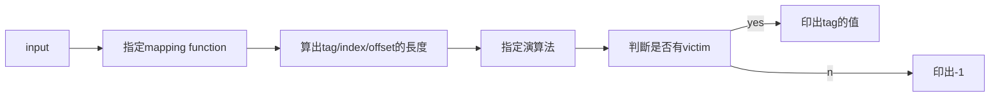

# 簡易版cache實作
## 環境
GCC 4.4.7 on Linux Ubuntu 16.04
## 程式流程

- ### input
 > 第一行為cache size(KB)
 > 第二行為block size(Byte)
 > 第三行為cache的架構(0~2)，0 : direct-mapped， 1 : four-way set associative, 2 : fully associative
 > 第四行為演算法(0~1)，0 : FIFO, 1 : LRU
 > 剩餘的則是存取的資料。

- ### 存取的資料結構


| tag | index | offset |
| -------- | -------- | -------- |

- ### mapping function
> #### Direct-Mapped : 每一個資料只可以放到cache中的唯一位置。
> #### 4-Way Set : 記憶體中的某一塊資料可能在cache中的4個位置出現。
> #### Full-Associative : 該資料塊可以和cache中的任意一個cache line對應。

- ###  the Replace algorithm
> #### FIFO : 將set中最早進入的資料塊加以取代。
> #### LRU : 將set中目前最不常用的的資料塊取代。


## 程式執行方式
```
./cache trace.txt trace.out
```
將結果輸出至```.out```檔。
```
make verify REQ_FILE=trace.txt VIC_FILE=trace.out
```
計算出miss rate

## 簡單例子說明
- trace1.txt(input)
```
1024 // cache size (KB)
16 // block size (Byte)
0 // associativity
0 // FIFO=0 , LRU=1
0xbfa437cc // No. 1
0xbfa437c8 // No. 2 ……
0xbfa437c4
0xbfa437c0
0xbfa437bc
0xbfa437b8
0xb80437b8
0xb8043794 
0xb80437c8
0xb80437cc
```

- 流程表格


| index | tag | victim or not          |
| ----- | --- |:---------------------- |
| 437c  | bfa | -1 (No.1~4)            |
| 437b  | bfa | -1 (No.5~6)            |
| 437b  | b80 | 3066(No.6 tag的十進位) |
| 4379  | b80 | -1 (No.8)              |
| 437c  | b80 | 3066(No.4 tag的十進位) |
| 437c  | b80 | -1(No.10)              |


## 輸出結果 (trace1.out)
```
-1
-1
-1
-1
-1
-1
3066
-1
3066
-1
```
